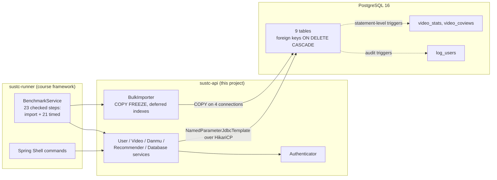
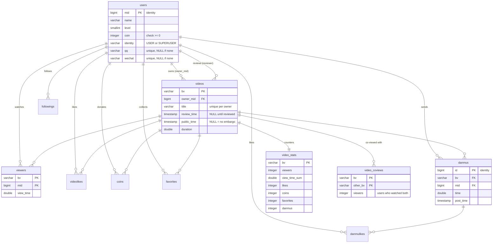

# Video-Sharing Platform Database System

**English** | [中文](README.zh-CN.md)

A PostgreSQL backend for a Bilibili-style video-sharing platform: users, videos, danmu (time-synced comments), likes / coins / favorites, follow relations, search and recommendations. Java 17, Spring Boot 2.7, hand-written SQL over JDBC (no ORM). It implements the service interfaces of a course framework, whose 23-step benchmark checks every answer and times the import and 21 of the other 22 steps.

**Results** (one machine, one PostgreSQL 16 server; the original implementation and this version ran alternately, 3 runs each, on one boot; medians; [methodology](#methodology)):

- Passes **all 5,622** benchmark cases; the original implementation passed 5,618.
- The 10 read and recommendation steps: **19.1 s → 1.08 s (17.6×)**. Similar videos ≈ 100×, general recommendations > 100×, personalized recommendations 34× (mostly through the general-recommendation fallback for users without friends), friend recommendations 18.6×, search 5×.
- The 11 write steps: **2.85 s → 3.35 s, 18 % slower**; [the write path](#the-write-path) measures where the time goes.
- All 21 timed steps together: **21.9 s → 4.4 s (4.9×)**. Data import (≈ 8.2 M rows): **91.7 s → 8.8 s (10.4×)**.
- Under concurrency ([WriteBench](#the-write-path), stress mode, 45 trials each): coin overspending in 45 of 45 trials in the original → 0 of 45, lost like and follow toggles 45/45 → 0/45, crossing account deletions failing 4/45 with the round-1 code → 0/45 (deadlocks are retried). Eight concurrent cascading deletes still deadlock ([known limitations](#known-limitations)).
- 142 tests (JUnit 5; 108 of them integration tests against PostgreSQL 16 in Testcontainers), passing on JDK 21 and, in an `eclipse-temurin:17-jdk` container, on JDK 17, in a fresh clone ([ci-proof.txt](docs/experiments/ci-proof.txt)). The CI workflow runs the same build on both, but has not run on GitHub yet.

By the medians, twelve steps are slower than before, by 5–165 ms each: ten of the eleven writes (delete account got faster) and the two cheapest reads (hotspots 14 → 19 ms, danmu display 72 → 80 ms). For danmu send, coin, collect, post video, register, follow and danmu display, the ranges of the two versions overlap.

> The interfaces in `io.sustc.service`, the DTOs in `io.sustc.dto` and the whole `sustc-runner` module (shell and benchmark) come from an MIT-licensed course framework (see [LICENSE](LICENSE)); the benchmark logic and data are unchanged. This project's work is `sustc-api/src/main/java/io/sustc/service/impl/`, the SQL in `sql/`, the tests, the scripts and the documentation.

## Contents

- [Architecture](#architecture)
- [Database design](#database-design)
- [Performance](#performance)
- [Correctness](#correctness)
- [Running it](#running-it)
- [Limits and safety](#limits-and-safety)
- [Known limitations](#known-limitations)

Deeper notes, one section per change with the key EXPLAIN plans: [docs/ENGINEERING_NOTES.md](docs/ENGINEERING_NOTES.md).

## Architecture


```mermaid
flowchart LR
    subgraph runner["sustc-runner (course framework)"]
        shell["Spring Shell commands"]
        bench["BenchmarkService<br/>23 checked steps:<br/>import + 21 timed"]
    end
    subgraph api["sustc-api (this project)"]
        services["User / Video / Danmu /<br/>Recommender / Database services"]
        auth["Authenticator"]
        importer["BulkImporter<br/>COPY FREEZE, deferred indexes"]
    end
    subgraph pg["PostgreSQL 16"]
        tables["9 tables<br/>foreign keys ON DELETE CASCADE"]
        derived["video_stats, video_coviews"]
        audit["log_users"]
    end
    shell --> services
    bench --> services
    bench --> importer
    services --> auth
    services -- "NamedParameterJdbcTemplate over HikariCP" --> tables
    importer -- "COPY on 4 connections" --> tables
    tables -. "statement-level triggers" .-> derived
    tables -. "audit triggers" .-> audit
```

- **Services** are Spring beans with constructor injection (`NamedParameterJdbcTemplate`, `Authenticator`, `Clock`); a REST layer can reuse them under the conditions in [HANDOFF.md](HANDOFF.md#adding-a-rest-layer). The `Clock` makes "now" testable; the benchmark pins it to the time its data was generated.
- **Every write is one call.** Coin donations, reviews, edits and cascading deletes are single statements (data-modifying CTEs, `ON CONFLICT`, foreign-key cascades); a toggle is an advisory lock on the acting user plus the toggle statement, sent in one round trip. Each call is atomic without an explicit transaction. Concurrent calls are covered by tests: toggles of one user are serialized, so none is lost; an edit locks its row before it reports the review state it replaced; co-view counts lock the viewer; and a call that loses a deadlock between two cascading deletes is retried (up to 3 attempts), which is not enough when eight run at once (see [known limitations](#known-limitations)).
- **Derived data lives in the database.** Per-video counters (`video_stats`) and co-viewing counts (`video_coviews`) are kept up to date by statement-level triggers, so recommendations read a few dozen rows instead of aggregating 2.2 M interaction rows per call.
- **The importer** bulk-loads with `COPY`, rebuilds indexes and constraints afterwards from the catalog, and if anything fails leaves the imported tables empty with the complete schema (the `users` audit log keeps the attempt).

## Database design

Schema: [`sql/build.sql`](sql/build.sql). Audit log: [`sql/audit.sql`](sql/audit.sql). Roles and privileges: [`sql/usercontrol.sql`](sql/usercontrol.sql).


```mermaid
erDiagram
    users ||--o{ videos : "owns (owner_mid)"
    users ||--o{ videos : "reviews (reviewer)"
    users ||--o{ followings : "follows"
    users ||--o{ viewers : "watches"
    users ||--o{ videolikes : "likes"
    users ||--o{ coins : "donates"
    users ||--o{ favorites : "collects"
    users ||--o{ danmus : "sends"
    users ||--o{ danmulikes : "likes"
    videos ||--o{ viewers : ""
    videos ||--o{ videolikes : ""
    videos ||--o{ coins : ""
    videos ||--o{ favorites : ""
    videos ||--o{ danmus : ""
    danmus ||--o{ danmulikes : ""
    videos ||--|| video_stats : "counters"
    videos ||--o{ video_coviews : "co-viewed with"

    users {
        bigint mid PK "identity"
        varchar name
        smallint level
        integer coin "check >= 0"
        varchar identity "USER or SUPERUSER"
        varchar qq "unique, NULL if none"
        varchar wechat "unique, NULL if none"
    }
    videos {
        varchar bv PK
        bigint owner_mid FK
        varchar title "unique per owner"
        timestamp review_time "NULL until reviewed"
        timestamp public_time "NULL = no embargo"
        double duration
    }
    viewers {
        varchar bv PK
        bigint mid PK
        double view_time
    }
    danmus {
        bigint id PK "identity"
        varchar bv FK
        bigint mid FK
        double time
        timestamp post_time
    }
    video_stats {
        varchar bv PK
        integer viewers
        double view_time_sum
        integer likes
        integer coins
        integer favorites
        integer danmus
    }
    video_coviews {
        varchar bv PK
        varchar other_bv PK
        integer viewers "users who watched both"
    }
```

**Conventions.** Each relation table is keyed by `(object, user)`, so "has user U liked video V?" is a primary-key probe. Foreign keys cascade on delete, so deleting a user or a video removes everything that refers to it in the same statement (the original code left danmu likes and some interactions behind). Real values are `double precision`, so sums are not accumulated in `float4`. Ids come from identity columns, which the importer moves past the imported ids. Empty QQ / WeChat ids are stored as `NULL`, so the unique constraints only apply to users who have one.

**Indexes and what they are for.** Every index below was chosen for a specific query; the plans are in [docs/explain](docs/explain).

| Index | Serves |
|---|---|
| `followings (follower_mid, followee_mid)` PK | whom a user follows; mutual-follow check |
| `followings (followee_mid, follower_mid)` | followers of a user; friend recommendations probe it once per followee as an index-only scan (the original plan scanned all 6 M rows) |
| `viewers / videolikes / coins / favorites (bv, mid)` PK | "did U watch / like … V", per-video lists |
| `… (mid, bv)` on the same four tables | everything a user did (user info, account deletion cascades, friends' views) as index-only scans |
| `videos (owner_mid, title)` unique | the spec's "same title for the same user" rule; also the owner's videos |
| `danmus (bv, time)` | danmu in a time range of a video, in order |
| `danmus (mid)`, `danmulikes (mid)`, `videos (reviewer)` | cascades when a user is deleted |
| `video_coviews (bv, other_bv)` PK, `(other_bv)` | similar videos: one index lookup of the video's co-viewing rows, then a top-5 sort; cascades |

**Derived tables.** `video_stats` holds per-video counts and the sum of view times; `video_coviews` holds, for every ordered pair of videos, the number of users who watched both. Statement-level `AFTER` triggers with transition tables apply the change of a whole statement as one `INSERT … ON CONFLICT DO UPDATE` (or one `DELETE`/`UPDATE` for co-views), in key order, so two firings of one trigger take the row locks they share in the same order. That order holds within one trigger only: a delete that cascades fires one trigger per cascaded table, so two concurrent cascading deletes can lock in crossing orders and deadlock (see [known limitations](#known-limitations)). The importer computes both tables in Java from the records and loads them with `COPY` like the other tables. A test replays a seeded random workload of service calls and multi-row SQL and compares both tables with a recomputation from scratch.

**Audit and roles.** `audit.sql` records every insert, update and delete on `users` (with the database role and time) through statement-level triggers. `usercontrol.sql` creates three roles with decreasing privileges, including what the derived-table triggers need, since triggers run with the invoking role's privileges.

## Performance

### Results

<!-- benchmark-table:start -->
| Step | Baseline ms (n=3) | Optimized ms (n=3) | Speedup | Passed (baseline → optimized) |
|---|---:|---:|---:|---:|
| 1 import | 91,728 [90,357–93,241] | 8,843 [8,184–8,943] | **10.4×** | – |
| 2 search | 255 [242–271] | 51 [44–53] | **5.0×** | 18 → 20 / 20 |
| 3 view rate | 51 [51–52] | 20 [15–23] | **2.5×** | 60 → 61 / 61 |
| 4 hotspot | 14 [10–15] | 19 [18–23] | 0.74× | 56 → 56 / 56 |
| 5 similar videos | 2,317 [2,178–2,517] | 23 [20–24] | **100.7×** | 43 → 43 / 43 |
| 6 general rec | 1,097 [1,006–1,292] | 5 [3–8] | **219.4×** | 11 → 11 / 11 |
| 7 user rec | 2,106 [1,902–2,156] | 62 [50–65] | **34.0×** | 27 → 27 / 27 |
| 8 friend rec | 12,768 [11,970–12,928] | 686 [519–708] | **18.6×** | 142 → 142 / 142 |
| 9 danmu display | 72 [42–91] | 80 [54–100] | 0.90× | 382 → 382 / 382 |
| 10 danmu send | 204 [161–350] | 369 [286–393] | 0.55× | 1016 → 1016 / 1016 |
| 11 user info | 277 [256–362] | 125 [118–182] | **2.2×** | 500 → 500 / 500 |
| 12 danmu like | not timed | not timed | – | 500 → 500 / 500 |
| 13 coin | 547 [448–640] | 567 [511–615] | 0.96× | 511 → 511 / 511 |
| 14 like | 591 [551–612] | 686 [642–718] | 0.86× | 686 → 686 / 686 |
| 15 collect | 469 [440–630] | 551 [550–642] | 0.85× | 644 → 644 / 644 |
| 16 post video | 55 [30–70] | 64 [58–72] | 0.86× | 184 → 184 / 184 |
| 17 register | 109 [100–110] | 118 [78–135] | 0.92× | 273 → 273 / 273 |
| 18 update video | 19 [16–27] | 33 [33–47] | 0.58× | 184 → 184 / 184 |
| 19 review | 18 [15–20] | 26 [24–33] | 0.69× | 35 → 35 / 35 |
| 20 search after update | 100 [99–112] | 9 [8–9] | **11.1×** | 5 → 6 / 6 |
| 21 delete video | 450 [439–450] | 591 [533–593] | 0.76× | 55 → 55 / 55 |
| 22 delete account | 337 [297–365] | 292 [291–319] | **1.2×** | 199 → 199 / 199 |
| 23 follow | 47 [31–47] | 56 [42–58] | 0.84× | 87 → 87 / 87 |
| **Read steps 2–9, 11, 20 (sum)** | **19,057** | **1,080** | **17.6×** | |
| **Write steps 10, 13–19, 21–23 (sum)** | **2,846** | **3,353** | 0.85× | |
| **All 21 timed steps (sum)** | **21,903** | **4,433** | **4.9×** | |
| **All test cases** | | | | **5618 → 5622 / 5622** |
<!-- benchmark-table:end -->

Generated by `python3 scripts/bench_table.py --write README.md README.zh-CN.md` from the raw reports in [docs/benchmark/round2/plain](docs/benchmark/round2/plain) (`c2-B<i>.json`: the original implementation; `c2-O<i>.json`: this version; run order B1, O1, B2, O2, B3, O3). Times are the median of 3 runs with the range in brackets; speedups divide the two medians. Step 12 is not timed by the framework. The harness's `compare.py` gives the same medians ([compare.txt](docs/benchmark/round2/plain/compare.txt)), and [report.txt](docs/benchmark/round2/plain/report.txt) has the per-run sums, the WAL of every write step and the checkpoints around them.

The earlier runs in [docs/benchmark/round1](docs/benchmark/round1) ran the two versions one after the other, hours apart, and are no longer quoted. The original implementation was slower in round 2 (its import took 57.7 s in round 1 and 90.4–93.2 s here); why was not measured, which is one reason the versions now alternate. The older `original-result.json` and `reference-standard.json` in [docs/benchmark](docs/benchmark) are from 2023 and another machine and are not used.

### What made the difference

The plans before and after are in [docs/explain](docs/explain) (`EXPLAIN (ANALYZE, BUFFERS)`, one run each, regenerated by `scripts/explain_plans.sh`). Their per-node timing inflates plans that produce many rows (on a 638 k-row join and aggregation it reported 200–205 ms, against 129–133 ms with `TIMING OFF` and 122–124 ms run plainly, three runs each: [docs/experiments/explain-overhead.txt](docs/experiments/explain-overhead.txt)), so the table takes the row counts from those plans and the times from the benchmark (step medians, original → this version).

| Change | Effect |
|---|---|
| Co-viewing counts kept in `video_coviews` | Similar videos: the original self-joins the 875 k-row `viewers` table on every call; now it reads the video's 43 co-viewing rows from an index and sorts them for the top 5. Step 5: 2,317 → 23 ms. |
| Per-video counters kept in `video_stats` | General recommendations: the original aggregates each of the five interaction tables (2.2 M rows in all) on every call; now it joins two 44-row tables. Step 6: 1,097 → 5 ms. Users without friends fall back to it, so personalized recommendations gain too: step 7: 2,106 → 62 ms. |
| Covering index `followings (followee_mid, follower_mid)` and a rewritten friend query | Step 8: 12,768 → 686 ms. With `VACUUM ANALYZE` run right after its import, the original still took 11.4–12.2 s with the same plan ([analyze runs](docs/benchmark/round2/analyze)), so missing statistics do not explain its time here. |
| Search counts non-overlapping occurrences with `replace()` and reads view counts from `video_stats` | Step 2: 255 → 51 ms. The original joined every view of every matching video and used the keywords as regular expressions. |
| Bulk import with `COPY … FREEZE`, indexes and constraints built afterwards, foreign keys validated in parallel, `VACUUM (ANALYZE)` at the end | Step 1: 91.7 s → 8.8 s; phases (median of the 3 runs): load 2.5 s, indexes 4.4 s, constraints 1.3 s, vacuum/analyze 0.2 s. |

### The write path

The 11 write steps take 2,846 ms in the original and 3,353 ms here (sums of the step medians). Round 1 put this down to the timing after the import; round 2 measured it ([per-run report](docs/benchmark/round2/plain/report.txt), [settle runs](docs/benchmark/round2/settle/report.txt), [WriteBench summary](docs/benchmark/round2/writebench/summary.md); details in the [engineering notes](docs/ENGINEERING_NOTES.md#the-write-path)):

- **Not writeback.** When step 10 starts, the kernel holds 1.1–2.0 MB of dirty data in this version's runs (63–90 MB in the original's).
- **The checkpoint after the import: about 5 %.** With a `CHECKPOINT` and a wait after the import (the settle variant), the write steps take 3,189 ms here and 2,892 ms in the original; the per-run sums overlap with those of the plain runs.
- **Full-page images: about the same in both versions**, except danmu send (112 kB → 2,307 kB of WAL). Its foreign key into `users` locks each sender's row, and the first lock on a page after a checkpoint writes an image of that page to the WAL ([fk-lock-wal.txt](docs/experiments/fk-lock-wal.txt)).
- **The rest is work per call.** WriteBench runs each write operation through the service layer of either jar, on the benchmark data, after a `CHECKPOINT` and 300 warm-up calls: 600 calls per operation, 5 alternating runs per version and client count. Median p50 in ms, original → this version, and the statements and round trips per call counted from the JDBC driver's messages:

| Operation | 1 client | 8 clients | Statements / round trips per call |
|---|---:|---:|---:|
| coin | 1.32 → 0.92 | 2.13 → 2.21 | 7 / 7 → 2 / 2 |
| like video | 0.71 → 0.84 | 1.35 → 2.09 | 5 / 5 → 3 / 2 |
| collect | 0.73 → 0.84 | 1.31 → 2.04 | 5 / 5 → 3 / 2 |
| danmu send | 0.76 → 0.83 | 1.71 → 1.94 | 5.05 / 5.05 → 2 / 2 |
| danmu like | 0.76 → 0.60 | 1.41 → 1.43 | 5 / 5 → 3 / 2 |
| post video | 0.55 → 0.76 | 1.16 → 1.64 | 4 / 4 → 2 / 2 |
| register | 0.45 → 0.45 | 0.97 → 0.82 | 2 / 2 → 1 / 1 |
| update video | 0.56 → 0.97 | 1.10 → 1.09 | 4 / 4 → 2 / 2 |
| review | 0.43 → 0.44 | 0.94 → 0.95 | 3 / 3 → 2 / 2 |
| delete video, no views | 1.15 → 1.10 | 2.47 → 1.83 | 9 / 9 → 2 / 2 |
| delete video, ≈ 20,000 views | 27.45 → 49.53 | 121 → 12,202 | 9 / 9 → 2 / 2 |
| delete account | 5.38 → 6.57 | 24.80 → 18,025 | 13 / 13 → 2 / 2 |
| follow | 0.73 → 0.71 | 1.17 → 1.51 | 4 / 4 → 3 / 2 |

8 clients: in this version's runs 4–6 of the 8 deletions of imported videos and 79–83 of the 100 account deletions failed with `deadlock detected` after 3 attempts, none in the original's; account deletions on 8 clients are runs of their own (3 per version, 100 calls each). This version's toggles send the lock statement and the toggle in one round trip.

The writes that got slower check foreign keys and maintain the counters of `video_stats`. pgbench puts the triggers of one like at about 0.13 ms and its foreign keys at 0.09 ms, the latter within the run-to-run noise (1.019, 0.887 and 0.794 ms with both, without the triggers and without both; 5 alternating rounds, [write-latency.txt](docs/experiments/write-latency.txt)). In the two deletes, the derived-table triggers take 4.2–4.5 ms of the 28.9–30.7 ms that deleting a video with 18,179 views takes on the server, and 10.0–13.2 ms of the 11.7–15.1 ms for an account with 23 views, most of it in the trigger on `viewers`, which updates the view counters and the 506 co-view rows of those views; by EXPLAIN ANALYZE, rolled back, 4 warm executions each ([delete-costs.after.txt](docs/explain/delete-costs.after.txt)). Coin donation is one statement and faster per call, but its benchmark step is not faster (547 → 567 ms); why was not measured. On 8 clients, like and collect lose about a third of their throughput, and cascading deletes deadlock with each other (see [known limitations](#known-limitations)).

### Methodology

- One machine (4 vCPUs, 15 GiB RAM), one PostgreSQL 16 server with the same configuration for all runs (`shared_buffers` 1 GB, `synchronous_commit` on, `full_page_writes` on, `wal_compression` off, `max_wal_size` 1 GB, `checkpoint_timeout` 5 min, JIT on). The baseline is the original implementation: the service code of `2e811bd`, built by the harness from `3796695` (branch `bench/baseline-clock`), which adds only the clock offset described below (jar sha256 `13515c67…`) with its own schema. This version ran as the jar built from `d0e24e2` (sha256 `42004a16…`); `sustc-api`, `sustc-runner` and `sql/` are the same in every commit from `cad2e6e` on.
- Each run starts from a freshly created schema (for this version `sql/build.sql` + `sql/audit.sql`) and runs the unchanged framework benchmark with the service clock pinned to 2023-12-30 12:00 +08:00 (`-Dsustc.clock.start=…`, JVM time zone Asia/Shanghai), when the bundled data was generated: several cases compare public times with "now". The original implementation reads `Instant.now()`; the harness's build of it adds a constant offset to reach the same start time. Its 4 failures come from its code: three searches whose keywords contain repeated spaces, and one view rate that is off in the fourth digit because view times are summed as `real`.
- 3 runs per version in the order B1, O1, B2, O2, B3, O3 (B: the original, O: this version), all on one boot (`uptime -s` is recorded before and after every run). Each run holds an exclusive lock that is released between runs, so other benchmarks on the machine can run between two runs but never during one. No run was discarded, and nothing runs inside the timed steps. Reported: median per step, range in brackets; pass counts are the minimum over the runs.
- Every run's log ends with the commit, the number of uncommitted tracked files (0 in every run), the jar's sha256 and the boot time. `scripts/bench_instrumented.py` watches each run from outside: the WAL position at the start and end of every step (`pg_waldump` turns those ranges into WAL and full-page-image bytes per step), the kernel's dirty memory, `pg_stat_wal` and `pg_stat_bgwriter` at the write steps, the server log's checkpoint lines, and the planner statistics of `followings` before step 8.
- Two diagnostic variants ran the same way, 3 runs each: *settle* pauses the runner after the import, runs a `CHECKPOINT` and waits until the kernel's dirty data is below 64 MB ([docs/benchmark/round2/settle](docs/benchmark/round2/settle); in run `c3-B1` the pause fell into step 2, whose time includes it), and *analyze* runs `VACUUM ANALYZE` in that pause, for the original only ([docs/benchmark/round2/analyze](docs/benchmark/round2/analyze)).
- The runs used a harness script outside this repository, driven by `scripts/bench_series.sh`; `scripts/benchmark.sh --label NAME` performs the same steps with the same JVM flags (localhost only by default, see below).

## Correctness

The original implementation failed 4 benchmark cases and had several problems the benchmark does not check. This version fixes them, each covered by a test:

- `follow` returns the state after the call; deleting an account removes the user's videos and everything on them, as well as everything the user did; deleting a video also removes its danmu likes.
- Similar videos break ties by `bv`; search relevance counts non-overlapping, case-insensitive occurrences (the Javadoc examples are tests; case folding uses ICU, so it also works for non-ASCII text on the benchmark database's C locale) and breaks ties by views, then `bv`. The `bv` tie-breaks compare bytes (`collate "C"`), whatever the database's default collation.
- Unreviewed videos and videos before their public time are visible only to their owner and superusers, in search and in like, coin and collect; danmus can be sent to or displayed on published videos only, and `likeDanmu` follows its Javadoc (the danmu exists and the user watched its video).
- Coin donation is one statement: the coin is charged only if the donation row is inserted (tested with 8 concurrent threads). Toggles, edits and co-view counts are safe under concurrency, and a deadlock between two cascading deletes is retried (see [Architecture](#architecture); for eight at once, [known limitations](#known-limitations)); `ConcurrencyTest` covers each case; 10 of its 11 tests fail on the code before these fixes, and all pass now ([concurrency-tests-old-vs-new.txt](docs/experiments/concurrency-tests-old-vs-new.txt)).
- Identity sequences continue after the imported ids; no code path leaks a pooled connection (checked after every integration test).

Interpretations of the specification where it is ambiguous are listed in [docs/ENGINEERING_NOTES.md](docs/ENGINEERING_NOTES.md#interpretations-of-the-specification).

## Running it

Requirements: JDK 17 or 21, Docker (for the tests and, optionally, the database).

```bash
# Build and run all tests (needs Docker: Testcontainers starts PostgreSQL 16)
./gradlew build

# A database for the runner: user, password and database are all "sustc"
cd sustc-runner && docker compose up -d && cd ..

# The course's test data (.ser files, not in this repository) goes to
#   sustc-runner/data/import/  and  sustc-runner/data/test/

# One benchmark run against a fresh schema; writes docs/benchmark/<label>.json
scripts/benchmark.sh --label my-run

# Rebuild the README table from docs/benchmark/round2/plain/c2-B*.json and c2-O*.json
python3 scripts/bench_table.py --write README.md README.zh-CN.md

# Micro-benchmarks and stress tests of the write operations (see scripts/writebench/run.sh)
scripts/writebench/run.sh --jar run/sustc-runner.jar --sql "sql/build.sql sql/audit.sql" \
    --out result.json -- --mode steady --clients 1 --ops 600 --warmup 300 --settle

# Interactive shell
./gradlew :sustc-runner:bootRun
```

## Limits and safety

- `scripts/benchmark.sh`, `scripts/explain_plans.sh`, `scripts/write_latency.sh` and `scripts/writebench/run.sh` **drop and recreate the `public` schema** of the target database. They accept only a loopback host (`localhost`, `127.*`, `::1`) unless `--allow-remote` is passed. Set `BENCH_LOCK=/path/to/lockfile` (or wrap the call in `flock`) to serialize timing runs on a shared machine.
- WriteBench runs at most 16 client threads and 5,000 calls per operation. `scripts/bench_instrumented.py`, WriteBench's `--settle` and `docs/experiments/fk-lock-wal.sh` run `CHECKPOINT` and `pg_waldump` through `sudo -u postgres`, so they need that right on the database host.
- Load on the database is bounded by the connection pool (HikariCP, default 10 connections; `spring.datasource.hikari.maximum-pool-size`) and by the importer's parallelism (`sustc.import.parallelism`, default 4 connections, at most one `COPY` stream each). There is no other network traffic and no bandwidth throttling.
- The benchmark itself runs some steps on a parallel stream; that is part of the unchanged framework.

## Known limitations

- Passwords are stored in plain text, as in the provided data. The `users` audit log no longer copies passwords, `qq` or `wechat` (an `AuthInfo` with only `qq` or `wechat` authenticates without a password); logs written by earlier versions contain them and must be purged.
- Concurrent deletions that cascade into the derived tables deadlock with each other. Two at once are retried until they succeed, but on 8 clients 4–6 of 8 deletions of imported videos and 79–83 of 100 account deletions failed with `deadlock detected` after 3 attempts, where the original completed all of them ([WriteBench summary](docs/benchmark/round2/writebench/summary.md)); serializing these deletes is the open fix ([open questions](docs/ENGINEERING_NOTES.md#open-questions)). At steady state, single-row writes that check foreign keys or maintain counters cost up to 0.41 ms more per call than the original's, and the cascading deletes 1.2 ms (an account) to 22 ms (a video with about 20,000 views) more; on 8 clients like and collect reach about a third less throughput.
- `video_coviews` holds up to N(N−1) rows for N videos (here all 1,892 pairs of the 44 videos exist), a new view by a user who watched k videos changes 2(k−1) of them, and deleting that user changes k(k−1). That is fine for this catalogue; a large one would need unordered pairs or a cap per user.
- Danmu display pays more for its first calls in a fresh JVM: the first pass over the benchmark's 382 cases takes 114.6 ms here against 71.6 ms in the original (median of 3 replays), while from the fourth pass on the two are within each other's ranges (36.2 and 34.9 ms); the benchmark times only the first pass (72 → 80 ms). Hotspots take 14 → 19 ms in the benchmark but are not slower in the replay (30.3 against 36.2 ms on the first pass). See [the notes](docs/ENGINEERING_NOTES.md#hotspots-and-danmu-display).
- Recommendations are not filtered by visibility; the specification does not ask for it.
- `TRUNCATE` bypasses the derived-table triggers; `DatabaseService.truncate()` empties the derived tables together with everything else.
- Each service call authenticates with a separate query before its statement; folding authentication into the statement would save one round trip per call.
